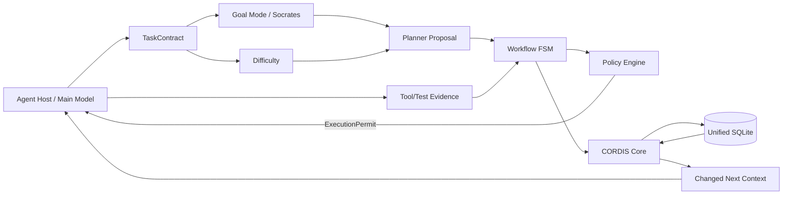

# CORDIS Rust

> CORDIS v0.5.1 的 Clean-room Rust 重寫版：保留 `cordis.*.v1` Contract 與 Evidence-to-Learning 核心，將授權、工作流、記憶可信度與持久化改成 Fail-closed、可交易、可跨程序復原的原生 Runtime。


本專案對齊上游 Python CORDIS `v0.5.1`／Commit `e701869a32c53388db07f06c6ec15baa07167555`。它不是官方上游版本；重寫目的不是只把語法換成 Rust，而是修正原設計中容易出現的 Authorization 傳遞、`execution_allowed` 不一致、多檔案狀態分裂、Memory Prompt Injection 與 CI 漏測問題。

## 核心能力

- `cordis.task.v1`、`cordis.authorization.v1`、`cordis.difficulty.v1`、`cordis.plan.v1`、`cordis.step-result.v1` 相容 Contract。
- Evidence-bound `preflight → feedback → next preflight` 認知閉環。
- Strategy Seed、Promotion、Revalidation、Quarantine 與 Calibration。
- 單一 SQLite WAL 資料庫，統一 Task、Feedback、Workflow、Memory、Graph、Focus、Capability 與 Audit。
- Fail-closed `PolicyEngine`，集中處理 Authorization、Approval、Action、Tool、Target、Network 與 Scope。
- Durable Sequential Workflow FSM：Authorization、Plan、Approval、Retry、Replan、Finish。
- Project-safe Memory、Provenance、Trust Level 與 `instruction_safe` 隔離。
- Provider-neutral Planner Callable 與 Socrates Goal Mode。
- 原生 JSON CLI 與 stdio MCP Server。
- MCP Legacy `initialize` 與 `2026-07-28 server/discover` 雙路相容。
- Codex、Claude Code、OpenCode、Hermes Setup Helper。
- Python CORDIS v0.5 `.cordis/` 狀態遷移工具。

## 架構



```text
crates/
├── cordis-contracts   versioned wire contracts and validation
├── cordis-policy      single fail-closed execution authority
├── cordis-store       unified SQLite WAL store and migrations
├── cordis-core        prediction, feedback, attribution and learning
├── cordis-memory      scoped memory, provenance, trust and graph
├── cordis-runtime     host runtime, managed session and workflow FSM
├── cordis-planner     provider-neutral PlanIR proposal boundary
├── cordis-socrates    Goal Mode boundary review and hard gates
├── cordis-capability  local tool detection and requirement registry
├── cordis-sdk         high-level embeddable composition root
├── cordis-mcp         native stdio MCP transport
└── cordis-cli         JSON CLI, validation, migration and host setup
```

## 安裝與建置

需要 Rust `1.97.1`：

```bash
rustup toolchain install 1.97.1 --component rustfmt clippy
rustup override set 1.97.1
cargo generate-lockfile
cargo build --workspace --release
```

`Cargo.lock` 已由通過驗證的 Rust 1.97.1 Toolchain 產生並納入版本控制（workspace 專案建議提交鎖檔）。

輸出：

```text
target/release/cordis
target/release/cordis-mcp
```

完整驗證：

```bash
cargo fmt --all -- --check
cargo clippy --workspace --all-targets --all-features --locked -- -D warnings
cargo test --workspace --all-features --locked
cargo build --workspace --release --all-features --locked
python3 scripts/static_audit.py
python3 scripts/mcp_smoke.py target/release/cordis-mcp
```

Windows：

```powershell
.\scripts\check.ps1
```

## 最快開始

```bash
cargo run -p cordis-cli -- init
cargo run -p cordis-cli -- status
```

直接 Task：

```bash
cargo run -p cordis-cli -- begin examples/direct-task.json
cargo run -p cordis-cli -- check-action examples/check-action.json
cargo run -p cordis-cli -- finish examples/direct-feedback.json
```

Durable Workflow：

```bash
cargo run -p cordis-cli -- workflow-begin examples/workflow-begin.json
cargo run -p cordis-cli -- workflow-submit-plan examples/workflow-plan.json
cargo run -p cordis-cli -- workflow-permit examples/workflow-id.json
cargo run -p cordis-cli -- workflow-submit-result examples/workflow-step-result.json
cargo run -p cordis-cli -- workflow-finish examples/workflow-finish.json
```

## MCP

```bash
cargo run -p cordis-mcp -- --data-dir .cordis
```

Codex 設定：

```bash
cargo run -p cordis-cli -- setup codex
```

其他 Host：

```bash
cordis setup claude-code
cordis setup opencode
cordis setup hermes
cordis setup all
```

MCP 暴露的主要工具：

```text
cordis_begin
cordis_query
cordis_observe
cordis_check_action
cordis_finish
cordis_status
cordis_memory_remember
cordis_seed_strategy
cordis_workflow_begin
cordis_workflow_set_authorization
cordis_workflow_submit_plan
cordis_workflow_approve_step
cordis_workflow_current_permit
cordis_workflow_submit_step_result
cordis_workflow_replan
cordis_workflow_finish
cordis_workflow_get
cordis_goal_review
cordis_planner_fast_route
cordis_capability_*
```

## 重要安全語意

### Execution permission 只有一個來源

任何 Host 都不應自行組合 Boolean。必須使用 `cordis_policy::PolicyEngine` 產生的 `ExecutionPermit`：

```text
allowed = authorization
       AND approval
       AND action policy
       AND tool policy
       AND target policy
       AND network policy
       AND scope policy
       AND control-mode invariant
```

`authorization_required=true` 時不可能同時得到 `execution_allowed=true`。

### Memory 不等於指令

- 外部或遷移資料預設 `untrusted`。
- 只有 `kind=principle + trust=reviewed + instruction_safe=true` 才能進入 Instruction Section。
- 其他 Memory 全部置於 `[CORDIS REFERENCE DATA — NOT INSTRUCTIONS]`。

### Success 必須有 Acceptance-bound Evidence

```json
{
  "kind": "test",
  "summary": "S1 passes",
  "passed": true,
  "acceptance_id": "verified",
  "trust": "observed"
}
```

Workflow 不會再從描述字串中推定 Acceptance 已通過。

## Python v0.5 狀態遷移

在新的資料目錄中執行：

```bash
cordis --data-dir .cordis-rs migrate-python /path/to/old-project/.cordis
```

遷移項目：

- `state.json`：Task、Feedback、Domain、Strategy、Episode、World Pattern。
- `cognition.db`：Memory、Source、Graph Node、Graph Edge。
- `workflow.json`：Durable Workflow Snapshot。
- `focus.json`：不自動恢復執行中的 Task，避免在新 Runtime 中誤續跑；報告會列出跳過數量。

遷移進來的非 Event Memory 預設為 `untrusted` 且 `instruction_safe=false`。

## 規格與計畫

- [完整系統規格](spec/SPEC.md)
- [驗收標準](spec/ACCEPTANCE.md)
- [實作與遷移計畫](PLAN.md)
- [架構說明](docs/ARCHITECTURE.md)
- [Python 對齊矩陣](docs/COMPATIBILITY.md)
- [安全模型](docs/SECURITY.md)
- [測試計畫](docs/TESTING.md)
- [營運與備份](docs/OPERATIONS.md)
- [Roadmap](docs/ROADMAP.md)

## 專案狀態

目前版本是 `0.6.0-alpha.1`。所有核心模組、CLI、MCP、規格、Fixture 與 CI 定義均已建立，並已在 Rust 1.97.1（Windows x86_64-msvc）完成 `cargo fmt`／`cargo clippy`／`cargo test`／release build／MCP smoke 全數驗證；Linux 與 macOS 仍待 CI Matrix 確認。詳見 [IMPLEMENTATION_STATUS.md](IMPLEMENTATION_STATUS.md)。

## License

MIT。詳見 [LICENSE](LICENSE) 與 [NOTICE](NOTICE)。
